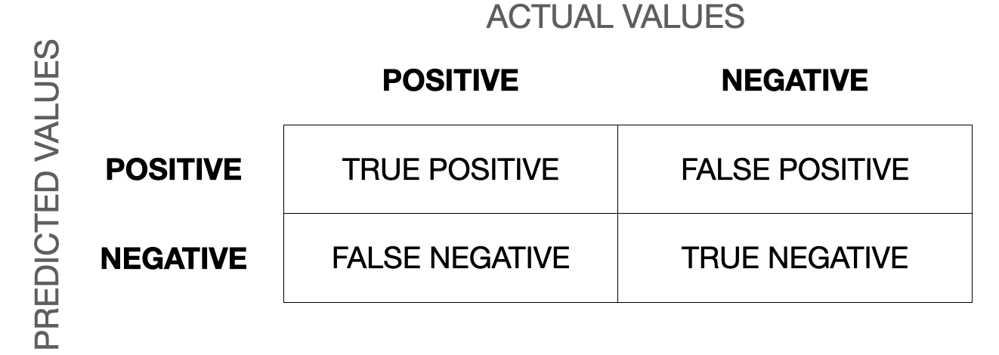

```{r echo=FALSE, message=FALSE, warning=FALSE}
vembedr::embed_youtube("HnVfx1Jy09s")
```

Sentiment analyses are fairly easy when you have your data in tidy text format. As they basically consist of matching the particular words' sentiment values to the corpus, this can be done with an `inner_join()`. `tidytext` comes with four dictionaries: bing, loughran, afinn, and nrc:

```{r}
needs(tidyverse, tidytext, sotu, SnowballC)
walk(c("bing", "loughran", "afinn", "nrc"), \(x) get_sentiments(lexicon = x) |> 
       head() |> 
       print())
```

As you can see here, the dictionaries are mere tibbles with two columns: "word" and "sentiment". For easier joining, I should call my column "word" in the preprocessing.

```{r message=FALSE, warning=FALSE}
needs(magrittr)

sotu_20cent_clean <- sotu_meta |> 
  mutate(text = sotu_text) |> 
  distinct(text, .keep_all = TRUE) |> 
  filter(between(year, 1900, 2000)) |> 
  unnest_tokens(output = word, input = text) |> 
  anti_join(get_stopwords()) |> 
  filter(!str_detect(word, "[0-9]")) |> 
  mutate(word = wordStem(word, language = "en"))
```

The AFINN dictionary is the only one with numeric values. You might have noticed that its words are not stemmed. Hence, I need to do this before I can join it with my tibble. To get the sentiment value per document, I can simply average it.

```{r message=FALSE, warning=FALSE}
sotu_20cent_afinn <- get_sentiments("afinn") |> 
  mutate(word = wordStem(word, language = "en")) |> 
  inner_join(sotu_20cent_clean) |> 
  group_by(year) |> 
  summarize(sentiment = mean(value))
```

Thereafter, I can just plot it:

```{r message=FALSE, warning=FALSE}
sotu_20cent_afinn |> 
  ggplot() +
  geom_line(aes(x = year, y = sentiment))
```

That's a bit hard to interpret. `geom_smooth()` might help:

```{r message=FALSE, warning=FALSE}
sotu_20cent_afinn |> 
  ggplot() +
  geom_smooth(aes(x = year, y = sentiment))
```

Interesting. When you think of the tone in the SOTU addresses as a proxy measure for the circumstances, the worst phase appears to be during the 1920s and 1930s -- might make sense given the then economic circumstances, etc. The maximum was in around the 1960s and since then it has, apparently, remained fairly stable.

### Assessing the results

However, we have no idea whether we are capturing some valid signal or not. Let's look at what drives those classifications the most:

```{r message=FALSE, warning=FALSE}
sotu_20cent_contribution <- get_sentiments("afinn") |> 
  mutate(word = wordStem(word, language = "en")) |> 
  inner_join(sotu_20cent_clean)  |>
  group_by(word) |>
  summarize(occurences = n(),
            contribution = sum(value))
```

```{r message=FALSE, warning=FALSE}
sotu_20cent_contribution |>
  slice_max(contribution, n = 10) |>
  bind_rows(sotu_20cent_contribution |> slice_min(contribution, n = 10)) |> 
  mutate(word = reorder(word, contribution)) |>
  ggplot(aes(contribution, word, fill = contribution > 0)) +
  geom_col(show.legend = FALSE) +
  labs(y = NULL)
```

Let's split this up per decade:

```{r message=FALSE, warning=FALSE}
get_sentiments("afinn") |> 
  mutate(word = wordStem(word, language = "en")) |> 
  inner_join(sotu_20cent_clean) |>
  mutate(decade = ((year - 1900)/10) |> floor()) |>
  group_by(decade, word) |>
  summarize(occurrences = n(),
            contribution = sum(value)) |> 
  slice_max(contribution, n = 5) |>
  bind_rows(get_sentiments("afinn") |> 
              mutate(word = wordStem(word, language = "en")) |> 
              inner_join(sotu_20cent_clean) |>
              mutate(decade = ((year - 1900)/10) |> floor()) |>
              group_by(decade, word) |>
              summarize(occurrences = n(),
                        contribution = sum(value)) |> 
              slice_min(contribution, n = 5)) |> 
  mutate(word = reorder_within(word, contribution, decade)) |>
  ggplot(aes(contribution, word, fill = contribution > 0)) +
  geom_col(show.legend = FALSE) +
  facet_wrap(~decade, ncol = 4, scales = "free") +
  scale_y_reordered()
```

### Assessing the quality of the rating

We need to assess the reliability of our classification (would different raters come to the same conclusion; and, if we compare it to a gold standard, how does the classification live up to its standards). One measure we can use here is Krippendorf's Alpha which is defined as

$$\alpha = \frac{D_o}{D_e}$$

where $D_{o}$ is the observed disagreement and $D_{e}$ is the expected disagreement (by chance). The calculation of the measure is far more complicated, but R can easily take care of that -- we just need to feed it with proper data. For this example I use a commonly used benchmark data set containing IMDb reviews of movies and whether they're positive or negative.

```{r message=FALSE, warning=FALSE}
imdb_reviews <- read_csv("https://www.dropbox.com/scl/fi/psgj6ze6at3zovildm728/imdb_reviews.csv?rlkey=ve2s02ydosbweemalvskyiu4s&dl=1")

glimpse(imdb_reviews)

imdb_reviews_afinn <- imdb_reviews |> 
  rowid_to_column("doc") |> 
  unnest_tokens(token, text) |> 
  anti_join(get_stopwords(), by = c("token" = "word")) |> 
  mutate(stemmed = wordStem(token)) |> 
  inner_join(get_sentiments("afinn") |> mutate(stemmed = wordStem(word))) |> 
  group_by(doc) |> 
  summarize(sentiment = mean(value)) |> 
  mutate(sentiment_afinn = case_when(sentiment > 0 ~ "positive",
                                     TRUE ~ "negative") |> 
           factor(levels = c("positive", "negative")))
```

Now we have two classifications, one "gold standard" from the data and the one obtained through AFINN.

```{r message=FALSE, warning=FALSE}
review_coding <- imdb_reviews |> 
  mutate(true_sentiment = sentiment |> 
           factor(levels = c("positive", "negative"))) |> 
  select(-sentiment) |> 
  rowid_to_column("doc") |> 
  left_join(imdb_reviews_afinn |> select(doc, sentiment_afinn)) 
```

First, we can check how often AFINN got it right, the accuracy:

```{r message=FALSE, warning=FALSE}
sum(review_coding$true_sentiment == review_coding$sentiment_afinn, na.rm = TRUE)/nrow(review_coding)
```

However, accuracy is not a perfect metric because it doesn't tell you anything about the details. For instance, your classifier might just predict "positive" all of the time. If your gold standard has 50 percent "positive" cases, the accuracy would lie at 0.5. We can address this using the following measures.

For the calculation of Krippendorff's Alpha, the data must be in a different format: a matrix containing with documents as columns and the respective ratings as rows.

```{r message=FALSE, warning=FALSE}
needs(irr)
mat <- review_coding |> 
  select(-text) |> 
  as.matrix() |> 
  t()

mat[1:3, 1:5]
colnames(mat) <- mat[1,]

mat <- mat[2:3,]
mat[1:2, 1:5]

irr::kripp.alpha(mat, method = "nominal")
```

Good are alpha values of around 0.8 -- AFINN missed that one.

Another way to evaluate the quality of classification is through a confusion matrix.



Now we can calculate precision (when it predicts "positive", how often is it correct), recall/sensitivity (when it is "positive", how often is this predicted), specificity (when it's "negative", how often is it actually negative). The [F1-score](https://deepai.org/machine-learning-glossary-and-terms/f-score) is the harmonic mean of precision and recall and defined as $F_1 = \frac{2}{\frac{1}{recall}\times \frac{1}{precision}} = 2\times \frac{precision\times recall}{precision + recall}$ and the most commonly used measure to assess the accuracy of the classification. The closer to 1 it is, the better. You can find a more thorough description of the confusion matrix and the different measures in [this blog post](https://machinelearningmastery.com/confusion-matrix-machine-learning/).

We can do this in R using the `caret` package.

```{r message=FALSE, warning=FALSE}
needs(caret)
confusion_matrix <- confusionMatrix(data = review_coding$sentiment_afinn, 
                                    reference = review_coding$true_sentiment,
                                    positive = "positive")
confusion_matrix$byClass
```

### Exercises

1.  Take the abortion-related Tweets from last chapter. Check for sentiment differences in parties. Use the AFINN dictionary. Plot your results.

<details>
  <summary>Solution. Click to expand!</summary>
```{r eval=FALSE}
needs(tidyverse, tidytext, stopwords, SnowballC)

timelines <- read_csv("https://www.dropbox.com/s/dpu5m3xqz4u4nv7/tweets_house_rep_party.csv?dl=1") |> 
  filter(!is.na(party))

keywords <- c("abortion", "prolife", " roe ", " wade ", "roevswade", "baby", "fetus", "womb", "prochoice", "leak")

preprocessed <- timelines |> 
  rowid_to_column("doc_id") |> 
  filter(str_detect(text, str_c(keywords, collapse = "|"))) |> 
  unnest_tokens(word, text) |> 
  anti_join(get_stopwords()) |> 
  mutate(stemmed = wordStem(word))

sent_per_party <- preprocessed |> 
  inner_join(get_sentiments("afinn")) |> 
  mutate(word_sent = case_when(value > 0 ~ "positive",
                                value < 0 ~ "negative"))
sent_per_party |> 
  ggplot() +
  geom_bar(aes(word_sent)) +
  facet_wrap(vars(party))         
         
sent_per_doc <- preprocessed |> 
  inner_join(get_sentiments("afinn")) |> 
  group_by(doc_id, party) |> 
  summarize(mean_sent = mean(value)) |> 
  mutate(tweet_sent = case_when(mean_sent > 0 ~ "positive",
                                mean_sent < 0 ~ "negative",
                                TRUE ~ "neutral"))

sent_per_doc |> 
  ggplot() +
  geom_bar(aes(tweet_sent)) +
  facet_wrap(vars(party))
```
</details>
  
2.  Have a look at different dictionaries (e.g., Bing or Loughran). Check the words that contributed the most. Do you see any immediate ambiguities or flaws?

<details>
  <summary>Solution. Click to expand!</summary>
```{r eval=FALSE}
# afinn
tweets_abortion_tidy_contribution_afinn <- preprocessed |> 
  inner_join(get_sentiments("afinn")) |> 
  group_by(party, word) |>
  summarize(contribution = sum(value))

bind_rows(
  tweets_abortion_tidy_contribution_afinn |> 
    filter(party == "D") |> 
    slice_max(contribution, n = 10, with_ties = FALSE) |> 
    mutate(type = "pos"),
  tweets_abortion_tidy_contribution_afinn |> 
    filter(party == "D") |> 
    slice_min(contribution, n = 10, with_ties = FALSE) |> 
    mutate(type = "neg"),
  tweets_abortion_tidy_contribution_afinn |> 
    filter(party == "R") |> 
    slice_max(contribution, n = 10, with_ties = FALSE) |> 
    mutate(type = "pos"),
  tweets_abortion_tidy_contribution_afinn |> 
    filter(party == "R") |> 
    slice_min(contribution, n = 10, with_ties = FALSE) |> 
    mutate(type = "neg")
) |> 
  mutate(word = reorder_within(word, contribution, party)) |>
  ggplot() +
  geom_col(aes(contribution, word), show.legend = FALSE) +
    scale_y_reordered() +
    facet_wrap(vars(party, type), scales = "free")

# loughran
needs(ggpubr)

tweets_abortion_tidy_contribution_loughran <- preprocessed |> 
  inner_join(get_sentiments("loughran")) |> 
  count(party, sentiment, word) |> 
  group_by(party, sentiment) |> 
  slice_max(n, n = 10, with_ties = FALSE) |> 
  group_split()

tweets_abortion_tidy_contribution_loughran |> 
  map(\(x) x |> 
        mutate(word = reorder_within(word, n, party)) |> 
        slice_max(n, n = 10) |> 
        ggplot() +
        geom_col(aes(n, word), show.legend = FALSE) +
        scale_y_reordered() +
        labs(title = x[["sentiment"]][1])
  ) |> 
  ggarrange(plotlist = _)
  
# bing
tweets_abortion_tidy_contribution_bing <- preprocessed |> 
  inner_join(get_sentiments("bing")) |> 
  count(party, sentiment, word) |> 
  group_by(party, word, sentiment) |> 
  summarize(contribution = sum(n)) |> 
  group_by(party, sentiment) |> 
  slice_max(contribution, n = 10, with_ties = FALSE) |> 
  mutate(contribution = case_when(
    sentiment == "negative" ~ contribution * (-1),
    TRUE ~ contribution
  ))

tweets_abortion_tidy_contribution_bing |> 
  mutate(word = reorder_within(word, contribution, party)) |>
  ggplot() +
  geom_col(aes(contribution, word), show.legend = FALSE) +
    scale_y_reordered() +
    facet_wrap(vars(party, sentiment), scales = "free")
```
</details>
  
## Further links

-   [Tidy text mining with R](https://www.tidytextmining.com/index.html).
-   A more general [introduction by Christopher Bail](https://cbail.github.io/textasdata/Text_as_Data.html).
-   [A guide to Using spacyr](https://spacy.io/api/token#attributes).
