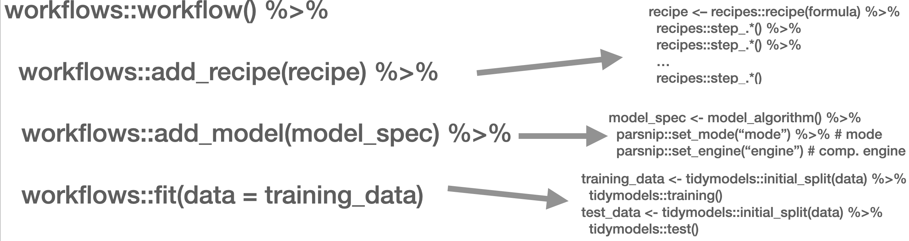

```{r echo=FALSE}
vembedr::embed_youtube("DELqEnh7_j0")
```

In the following script, I will introduce you to the supervised classification of text. Supervised means that I will need to "show" the machine a data set that already contains the value or label I want to predict (the "dependent variable") as well as all the variables that are used to predict the class/value (the independent variables or, in ML lingo, *features*). In the examples I will showcase, the features are the tokens that are contained in a document. Dependent variables are in my example sentiment.

## The Process

Overall, the process of supervised classification using text in R encompasses the following steps:

1.  Split data into training and test set
2.  Pre-processing and featurization
3.  Training
4.  Evaluation and tuning (through cross-validation) (… repeat 2.-4. as often as necessary)
5.  Applying the model to the held-out test set
6.  Final evaluation

This is mirrored in the `workflow()` function from the `workflows` [@vaughan_workflows_2022] package. There, you define the pre-processing procedure (`add_recipe()` -- created through the `recipe()` function from the `recipes` [@kuhn_recipes_2022] and/or `textrecipes` [@hvitfeldt_textrecipes_2022] package(s)), the model specification with `add_spec()` -- taking a model specification as created by the `parsnip` [@kuhn_parsnip_2022] package.



In the next part, other approaches such as Support Vector Machines (SVM), penalized logistic regression models (penalized here means, loosely speaking, that insignificant predictors which contribute little will be shrunk and ignored -- as the text contains many tokens that might not contribute much, those models lend themselves nicely to such tasks), random forest models, or XGBoost will be introduced. Those approaches are not to be explained in-depth, third-party articles will be linked though, but their intuition and the particularities of their implementation will be described. Since we use the `tidymodels` [@kuhn_tidymodels_2020] framework for implementation, trying out different approaches is straightforward. Also, the pre-processing differs, `recipes` and `textrecipes` facilitate this task decisively. Third, the evaluation of different classifiers will be described. Finally, the entire workflow will be demonstrated using a Twitter data set.

The first example for today's session is the IMDb data set. First, we load a whole bunch of packages and the data set.

```{r message=FALSE, warning=FALSE}
needs(discrim, glmnet, textrecipes, tidymodels, tidytext, tidyverse, workflows)

imdb_data <- read_csv("https://www.dropbox.com/s/0cfr4rkthtfryyp/imdb_reviews.csv?dl=1")
```

### Split the data

The first step is to divide the data into training and test sets using `initial_split()`. You need to make sure that the test and training set are fairly balanced which is achieved by using `strata =`. `prop =` refers to the proportion of rows that make it into the training set.

```{r}
split <- initial_split(imdb_data, prop = 0.2, strata = sentiment)

imdb_train <- training(split)
imdb_test <- testing(split)

glimpse(imdb_train)
imdb_train |> count(sentiment)
```

### Pre-processing and featurization

In the `tidymodels` framework, pre-processing and featurization are performed through so-called `recipes`. For text data, so-called `textrecipes` are available.

### `textrecipes` -- basic example

In the initial call, the formula needs to be provided. In our example, we want to predict the sentiment ("positive" or "negative") using the text in the review. Then, different steps for pre-processing are added. Similar to what you have learned in the prior chapters containing measures based on the bag of words assumption, the first step is usually tokenization, achieved through `step_tokenize()`. In the end, the features need to be quantified, either through `step_tf()`, for raw term frequencies, or `step_tfidf()`, for TF-IDF. In between, various pre-processing steps such as word normalization (i.e., stemming or lemmatization), and removal of rare or common words Hence, a recipe for a very basic model just using raw frequencies and the 1,000 most common words would look as follows:

```{r}
imdb_basic_recipe <- recipe(sentiment ~ text, data = imdb_train) |> 
  step_tokenize(text) |> # tokenize text
  step_tokenfilter(text, max_tokens = 1000) |> # only retain 1000 most common words
  # additional pre-processing steps can be added, see next chapter
  step_tfidf(text) # final step: add term frequencies
```

In case you want to know what the data set for the classification task looks like, you can `prep()` and finally `bake()` the recipe. Note that we need to specify the data set we want to pre-process in the recipe's manner. In our case, we want to perform the operations on the data specified in the `basic_recipe` and, hence, need to specify `new_data = NULL`.

```{r}
imdb_basic_recipe |> 
  prep() |> 
  bake(new_data = NULL)
```

### `textrecipes` -- further preprocessing steps

More steps exist. These always follow the same structure: their first two arguments are the recipe (which in practice does not matter, because they are generally used in a "pipeline") and the variable that is affected (in our example "text" because it is the one to be modified). The rest of the arguments depends on the function. In the following, we will briefly list them and their most important arguments. Find the exhaustive list [here](https://cran.r-project.org/web/packages/textrecipes/textrecipes.pdf),

-   `step_tokenfilter()`: filters tokens
    -   `max_times =` upper threshold for how often a term can appear (removes common words)
    -   `min_times =` lower threshold for how often a term can appear (removes rare words)
    -   `max_tokens =` maximum number of tokens to be retained; will only keep the ones that appear the most often
    -   you should filter before using `step_tf` or `step_tfidf` to limit the number of variables that are created
-   `step_lemma()`: allows you to extract the lemma
    -   in case you want to use it, make sure you tokenize via `spacyr` (by using `step_tokenize(text, engine = "spacyr"))`
-   `step_pos_filter()`: adds the Part-of-speech tags
    -   `keep_tags =` character vector that specifies the types of tags to retain (default is "NOUN", for more details see [here](https://github.com/explosion/spaCy/blob/master/spacy/glossary.py) or consult chapter \@ref(day4))
    -   in case you want to use it, make sure you tokenize via `spacyr` (by using `step_tokenize(text, engine = "spacyr"))`
-   `step_stem()`: stems tokens
    -   `custom_stem =` specifies the stemming function. Defaults to `SnowballC`. Custom functions can be provided.
    -   `options =` can be used to provide arguments (stored as named elements of a list) to the stemming function. E.g., `step_stem(text, custom_stem = "SnowballC", options = list(language = "russian"))`
-   `step_stopwords()`: removes stopwords
    -   `source =` alternative stopword lists can be used; potential values are contained in `stopwords::stopwords_getsources()`
    -   `custom_stopword_source =` provide your own stopword list
    -   `language =` specify language of stop word list; potential values can be found in `stopwords::stopwords_getlanguages()`
-   `step_ngram()`: takes into account order of terms, provides more context
    -   `num_tokens =` number of tokens in n-gram -- defaults to 3 -- trigrams
    -   `min_num_tokens =` minimal number of tokens in n-gram -- `step_ngram(text, num_tokens = 3, min_num_tokens = 1)` will return all uni-, bi-, and trigrams.
-   `step_word_embeddings()`: use pre-trained embeddings for words
    -   `embeddings()`: tibble of pre-trained embeddings
-   `step_normalize()`: performs unicode normalization as a preprocessing step
    -   `normalization_form =` which Unicode Normalization to use, overview in [`stringi::stri_trans_nfc()`](https://www.rdocumentation.org/packages/stringi/versions/1.7.6/topics/stri_trans_nfc)
-   `themis::step_upsample()` takes care of unbalanced dependent variables (which need to be specified in the call)
    -   `over_ratio =` ratio of desired minority-to-majority frequencies

### Model specification

Now that the data is ready, the model can be specified. The `parsnip` package is used for this. It contains a model specification, the type, and the engine. For Naïve Bayes, this would look like the following (note that you will need to install the relevant packages -- here: `discrim` -- before using them):

```{r}
nb_spec <- naive_Bayes() |> # the initial function, coming from the parsnip package
  set_mode("classification") |> # classification for discrete values, regression for continuous ones
  set_engine("naivebayes") # needs to be installed
```

Other model specifications you might deem relevant:

-   Logistic regression

```{r}
lr_spec <- logistic_reg() |>
  set_engine("glm") |>
  set_mode("classification")
```

-   Logistic regression (penalized with Lasso):

```{r}
lasso_spec <- logistic_reg(mixture = 1) |>
  set_engine("glm") |>
  set_mode("classification") 
```

-   SVM (here, `step_normalize(all_predictors())` needs to be the last step in the recipe)

```{r}
svm_spec <- svm_linear() |>
  set_mode("regression") |> # can also be "classification"
  set_engine("LiblineaR")
```

-   Random Forest (with 100 decision trees):

```{r}
rf_spec <- rand_forest(trees = 100) |>
  set_engine("ranger") |>
  set_mode("classification") # can also be "regression"
```

-   xgBoost (with 20 decision trees):

```{r}
xg_spec <- boost_tree(trees = 20) |> 
  set_engine("xgboost") |>
  set_mode("regression") # can also be classification
```

### Model training -- `workflows`

A workflow can be defined to train the model. It will contain the recipe, hence taking care of the pre-processing, and the model specification. In the end, it can be used to fit the model.

```{r}
imdb_nb_wf <- workflow() |> 
  add_recipe(imdb_basic_recipe) |> 
  add_model(nb_spec)
```

It can then be fit using `fit()`.

```{r}
imdb_nb_basic <- imdb_nb_wf |> fit(data = imdb_train)
```

### Model evaluation

```{r echo=FALSE}
vembedr::embed_youtube("RVRyBQOB1jc")
```

Now that a first model has been trained, its performance can be evaluated. In theory, we have a test set for this. However, the test set is precious and should only be used once we are sure that we have found a good model. Hence, for these intermediary tuning steps, we need to come up with another solution. So-called cross-validation lends itself nicely to this task. The rationale behind it is that chunks from the training set are used as test sets. So, in the case of 10-fold cross-validation, the training set is divided into 10 distinctive chunks of data. Then, 10 models are trained on the respective 9/10 of the training set that is not used for evaluation. Finally, each model is evaluated against the respective held-out "test set" and the performance metrics averaged.


First, the folds need to be determined. we set a seed in the beginning to ensure reproducibility.

```{r}
needs(tune)

set.seed(123)
imdb_folds <- vfold_cv(imdb_train)
```

`fit_resamples()` trains models on the respective samples. (Note that for this to work, no model must have been fit to this workflow before. Hence, you either need to define a new workflow first or restart the session and skip the fit-line from before.)

```{r eval=FALSE}
imdb_nb_resampled <- fit_resamples(
  imdb_nb_wf,
  imdb_folds,
  control = control_resamples(save_pred = TRUE),
  metrics = metric_set(accuracy, recall, precision)
)

#imdb_nb_resampled |> write_rds("imdb_nb_resampled.rds")
```

```{r eval=TRUE, include=FALSE}
imdb_nb_resampled <- read_rds("https://www.dropbox.com/s/ijmom7xvw46yvaa/imdb_nb_resampled.rds?dl=1")
```

`collect_metrics()` can be used to evaluate the results.

-   Accuracy tells me the share of correct predictions overall
-   Precision tells me the number of correct positive predictions
-   Recall tells me how many actual positives are predicted properly

In all cases, values close to 1 are better.

`collect_predictions()` will give you the predicted values.

```{r}
nb_rs_metrics <- collect_metrics(imdb_nb_resampled)
nb_rs_predictions <- collect_predictions(imdb_nb_resampled)
```

This can also be used to create the confusion matrix by hand.

```{r}
confusion_mat <- nb_rs_predictions |> 
  group_by(id) |> 
  mutate(confusion_class = case_when(.pred_class == "positive" & sentiment == "positive" ~ "TP",
                                     .pred_class == "positive" & sentiment == "negative" ~ "FP",
                                     .pred_class == "negative" & sentiment == "negative" ~ "TN",
                                     .pred_class == "negative" & sentiment == "positive" ~ "FN")) |> 
  count(confusion_class) |> 
  ungroup() |> 
  pivot_wider(names_from = confusion_class, values_from = n)
```

Now you can go back and adapt the pre-processing recipe, fit a new model, or try a different classifier, and evaluate it against the same set of folds. Once you are satisfied, you can proceed to check the workflow on the held-out test data.

### Hyperparameter tuning

Some models also require the tuning of hyperparameters (for instance, lasso regression). If we wanted to tune these values, we could do so using the `tune` package. There, the parameter that needs to be tuned gets a placeholder in the model specification. Through variation of the placeholder, the optimal solution can be empirically determined.

So, in the first example, we will try to determine a good penalty value for LASSO regression.

```{r}
lasso_tune_spec <- logistic_reg(penalty = tune(), mixture = 1) |>
  set_mode("classification") |>
  set_engine("glmnet")
```

We will also play with the numbers of tokens to be included:

```{r}
imdb_tune_basic_recipe <- recipe(sentiment ~ text, data = imdb_train) |> 
  step_tokenize(text) |>
  step_tokenfilter(text, max_tokens = tune()) |> 
  step_tf(text)
```

The `dials` [@kuhn_dials_2022] package provides the handy `grid_regular()` function which chooses suitable values for certain parameters.

```{r}
lambda_grid <- grid_regular(
  penalty(range = c(-4, 0)), 
  max_tokens(range = c(1e3, 2e3)),
  levels = c(penalty = 3, max_tokens = 2)
)
```

Then, we need to define a new workflow, too.

```{r}
lasso_tune_wf <- workflow() |> 
  add_recipe(imdb_tune_basic_recipe) |>
  add_model(lasso_tune_spec)
```

For the resampling, we can use `tune_grid()` which will use the workflow, a set of folds (we use the ones we created earlier), and a grid containing the different parameters.

```{r eval=FALSE}
set.seed(123)

tune_lasso_rs <- tune_grid(
  lasso_tune_wf,
  imdb_folds,
  grid = lambda_grid,
  metrics = metric_set(accuracy, sensitivity, specificity)
)
```

```{r include=FALSE}
tune_lasso_rs <- read_rds("https://www.dropbox.com/s/pbkeugsbzw7pgh2/tuned_lasso.rds?dl=1")
```

Again, we can access the resulting metrics using `collect_metrics()`:

```{r}
collect_metrics(tune_lasso_rs)
```

We can also visualize this:

```{r}
collect_metrics(tune_lasso_rs) |> 
  ggplot() +
  geom_line(aes(penalty, mean, color = as_factor(max_tokens))) +
  facet_wrap(vars(.metric), nrow = 3) +
  scale_x_log10(breaks = c(0.0001, 0.01, 1)) 
```

Also, we can use `show_best()` to look at the best result. Subsequently, `select_best()` allows me to choose it. In real life, we would choose the best trade-off between a model as simple and as good as possible. Using `select_by_pct_loss()`, we choose the one that performs still more or less on par with the best option (i.e., within 2 percent accuracy) but is considerably simpler. Finally, once we are satisfied with the outcome, we can `finalize_workflow()` and fit the final model to the test data.

```{r}
show_best(tune_lasso_rs, metric = "accuracy")

final_lasso_imdb <- finalize_workflow(lasso_tune_wf, select_by_pct_loss(tune_lasso_rs, metric = "accuracy", -penalty))
```

### Final fit

Now we can finally fit our model to the training data and predict on the test data. `last_fit()` is the way to go. It takes the workflow and the split (as defined by `initial_split()`) as parameters.

```{r}
final_fitted <- last_fit(final_lasso_imdb, split)

collect_metrics(final_fitted)

collect_predictions(final_fitted) |>
  conf_mat(truth = sentiment, estimate = .pred_class) |>
  autoplot(type = "heatmap")
```

## Supervised ML with `tidymodels` in a nutshell

```{r echo=FALSE}
vembedr::embed_youtube("YRtZZi0Ss5E")
```

Here, we give you the condensed version of how you would train a model on a number of documents and predict on a certain test set. To exemplify this, I use Tweets from British MPs from the two largest parties.

First, you take your data and split it into training and test set:

```{r}
set.seed(1)
timelines_gb <- read_csv("https://www.dropbox.com/s/1lrv3i655u5d7ps/timelines_gb_2022.csv?dl=1")

split_gb <- initial_split(timelines_gb, prop = 0.3, strata = party)
party_tweets_train_gb <- training(split_gb)
party_tweets_test_gb <- testing(split_gb)
```

Second, define your text pre-processing steps. In this case, we want to predict partisanship based on textual content. We tokenize the text, upsample to have balanced classed in terms of party in the training set, and retain only the 1,000 most commonly appearing tokens.

```{r}
twitter_recipe <- recipe(party ~ text, data = party_tweets_train_gb) |> 
  step_tokenize(text) |> # tokenize text
  themis::step_upsample(party) |> 
  step_tokenfilter(text, max_tokens = 1000) |>
  step_tfidf(text) 
```

Third, the model specification needs to be defined. In this case, we go with a random forest classifier containing 50 decision trees.

```{r}
rf_spec <- rand_forest(trees = 50) |>
  set_engine("ranger") |>
  set_mode("classification") 
```

Finally, the pre-processing "recipe" and the model specification can be summarized in one workflow and the model can be fit to the training data.

```{r}
twitter_party_rf_workflow <- workflow() |> 
  add_recipe(twitter_recipe) |> 
  add_model(rf_spec)

party_gb <- twitter_party_rf_workflow |> fit(data = party_tweets_train_gb)
```

Now we have arrived at a model we can apply to make predictions using `augment()`. Finally, we can evaluate its accuracy on the test data by taking the share of correctly predicted values.

```{r}
predictions_gb <- augment(party_gb, party_tweets_test_gb)
mean(predictions_gb$party == predictions_gb$.pred_class)
```

## Side note: Active learning

The `augment()` function can also be used to choose observations whose annotation could boost the classifier's performance. Here we want to find the tweets whose `.pred_Conservative` and `.pred_Labour` are close to 0.5. An exemplary script for choosing new observations for annotation can look like this. Of course, this example is fictitious as we already have all the labels. If you were to use this for creating an annotation set, make sure to remove the labels (here: `party`) before looking at the data to maintain the validity of the annotation process. Also, adding an id helps with joining the data after annotation.

```{r}
anno_set_active_learning <- predictions_gb |> 
  mutate(distance_cons_05 = abs(.pred_Conservative-0.5),
         distance_lab_05 = abs(.pred_Conservative-0.5)) |> 
  group_by(party, text) |> 
  summarize(dist_05 = min(distance_cons_05, distance_lab_05)) |> 
  ungroup() |> 
  slice_min(dist_05, n = 100) |> 
  rowid_to_column("id")

for_annotation <- anno_set_active_learning |> select(id, text)
```

## Further links

-   Check out the [SMLTAR book](https://smltar.com)
-   More on [tidymodels](https://www.tidymodels.org)
-   Basic [descriptions of ML models](https://www.simplilearn.com/10-algorithms-machine-learning-engineers-need-to-know-article)
-   More on prediction with text using [tidymodels](https://www.tidymodels.org/learn/work/tune-text/)

## Exercises

1.  Measuring polarization of language through a "fake prediction." Train the same model that we trained on British MPs earlier on `timelines_us <- read_csv("https://www.dropbox.com/s/dpu5m3xqz4u4nv7/tweets_house_rep_party.csv?dl=1")`. First, split the new data into training and test set (`prop = 0.3` should suffice, make sure that you set `strata = party`). Train the model using the same workflow but new training data that predicts partisanship based on the Tweets' text. Predict on the test set and compare the models' accuracy.

```{r eval=FALSE}
set.seed(1)
timelines_uk <- read_csv("https://www.dropbox.com/s/1lrv3i655u5d7ps/timelines_gb_2022.csv?dl=1")
timelines_us <- read_csv("https://www.dropbox.com/s/iglayccyevgvume/timelines_us.csv?dl=1")
```

<details>
  <summary>Solution. Click to expand!</summary>
```{r eval=FALSE}
split_gb <- initial_split(timelines_gb, prop = 0.3, strata = party)
party_tweets_train_gb <- training(split_gb)
party_tweets_test_gb <- testing(split_gb)

split_us <- initial_split(timelines_us, prop = 0.3, strata = party)
party_tweets_train_us <- training(split_us)
party_tweets_test_us <- testing(split_us)

twitter_recipe <- recipe(party ~ text, data = party_tweets_train_gb) |> 
  step_tokenize(text) |> # tokenize text
  themis::step_upsample(party) |> 
  step_tokenfilter(text, max_tokens = 1000) |>
  step_tfidf(text) 

rf_spec <- rand_forest(trees = 50) |>
  set_engine("ranger") |>
  set_mode("classification") 

twitter_party_rf_workflow <- workflow() |> 
  add_recipe(twitter_recipe) |> 
  add_model(rf_spec)

party_gb <- twitter_party_rf_workflow |> fit(data = party_tweets_train_gb)
party_us <- twitter_party_rf_workflow |> fit(data = party_tweets_train_us)

predictions_gb <- augment(party_gb, party_tweets_test_gb)
mean(predictions_gb$party == predictions_gb$.pred_class)

predictions_us <- augment(party_us, party_tweets_test_us)
mean(predictions_us$party == predictions_us$.pred_class)
```
</details>

2.  Extract Tweets from U.S. timelines that are about abortion by using the keywords. Perform the same prediction task (but now with `initial_split(prop = 0.8)`). How does the accuracy change?

```{r eval=FALSE}
keywords <- c("abortion", "prolife", " roe ", " wade ", "roevswade", "baby", "fetus", "womb", "prochoice", "leak")
timelines_us_abortion <- timelines_us |> filter(str_detect(text, keywords |> str_c(collapse = "|")))
```

<details>
  <summary>Solution. Click to expand!</summary>
```{r eval=FALSE}
split_us_abortion <- initial_split(timelines_us_abortion, prop = 0.8, strata = party)
abortion_tweets_train_us <- training(split_us_abortion)
abortion_tweets_test_us <- testing(split_us_abortion)

abortion_us <- twitter_party_rf_workflow |> fit(data = abortion_tweets_train_us)

predictions_abortion_us <- augment(abortion_us, abortion_tweets_test_us)
mean(predictions_abortion_us$party == predictions_abortion_us$.pred_class)
```
</details>