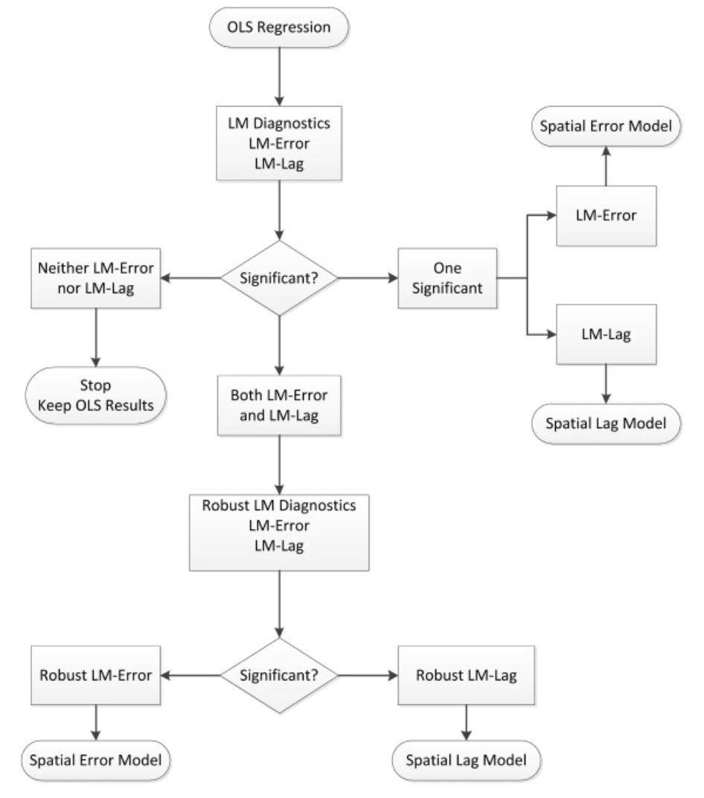

This tutorial demonstrates how to do statistical inference with spatial data in R, specifically focusing on analyzing data on child poverty in the U.S. South^[I found this data while browsing the web for inspiration in [this excellent tutorial](https://chrismgentry.github.io/Spatial-Regression/#132_Spatial_Durbin_Error_Model). I use more States in my example, different code, and explain it a bit differently, yet I would like to extend my gratitude to Prof. Gentry for the data]. This tutorial will cover different types of spatial models and how to interpret them, as well as helper functions on which model to choose. Statistical inference will be performed using the `spatialreg` package. e

## Data preparation

```{r}
needs(sf, tidyverse, tigris, maps, janitor, RColorBrewer, classInt, spatialreg, spdep)
```

```{r message=FALSE}
us_counties <- counties(cb = TRUE, resolution = "20m", year = 2016, progress_bar = FALSE) |> 
  st_transform(5070) |> 
  mutate(FIPS = str_c(STATEFP, COUNTYFP))

child_pov <- read_csv("https://raw.githubusercontent.com/chrismgentry/Spatial-Regression/master/Data/childpov18_southfull.csv") |> 
  mutate(FIPS = as.character(FIPS),
         FIPS = case_when(
           str_length(FIPS) == 4 ~ str_c("0", FIPS),
           TRUE ~ FIPS
  ))

us_counties_child_pov <- left_join(us_counties, child_pov, by = "FIPS") |> 
  clean_names() |> 
  drop_na(x2016_child_poverty)

breaks <- classIntervals(us_counties_child_pov$x2016_child_poverty, 
                        n = 7, 
                        style = "jenks")


us_counties_child_pov |> 
  ggplot() +
  geom_sf(aes(fill = x2016_child_poverty), 
          color = "gray90", 
          size = 0.1) +
  scale_fill_gradientn(
    colors = brewer.pal(7, "YlOrRd"),
    breaks = round(breaks$brks, 1),
    labels = function(x) paste0(round(x, 0), "%"),  # Round to whole numbers
    name = "Child Poverty Rate",
    guide = guide_colorbar(
      direction = "horizontal",
      title.position = "top",
      label.position = "bottom",
      barwidth = 15,
      barheight = 0.5,
      ticks.colour = "gray50"
    )
  ) +
  theme_minimal() +
  theme(
    plot.title = element_text(hjust = 0.5, 
                             size = 16, 
                             face = "bold",
                             margin = margin(b = 10)),
    plot.subtitle = element_text(hjust = 0.5, 
                               size = 10,
                               color = "gray30",
                               margin = margin(b = 20)),
    plot.caption = element_text(color = "gray30", 
                               size = 8,
                               margin = margin(t = 10)),
    legend.position = "bottom",
    legend.title = element_text(size = 9),
    legend.text = element_text(size = 8),
    axis.text = element_text(size = 8, color = "gray50"),
    panel.grid = element_line(color = "gray95"),
    plot.margin = margin(10, 10, 10, 10)
  ) +
  labs(
    title = "Child Poverty in the South",
    subtitle = "Distribution of child poverty rates by county, 2016",
    caption = "Data source: US Census Bureau via tigris | Projection: Contiguous Albers Equal Area"
  )
```

## Modeling Child Poverty in the South

Let's move on to statistically explain child poverty in the South. The data set contains some variables that might matter in this case. In particular, there is information on race composition (i.e., the share of Blacks and Latinx people), the composition of the labor market (i.e., different sectors), unemployment, single motherhood, unmarried people, share of people with less than a high school degree, and the share of uninsured people. 

### OLS

We'll throw all these in a first OLS model with child poverty as the dependent variable, not taking into account any spatial variables. The independent variables are logged using the natural logarithm when appropriate to ensure a more normal distribution.

```{r}
ols_mod <- lm(x2016_child_poverty ~ lnmanufacturing + lnretail + lnhealthss + lnconstruction + 
                lnlesshs + lnunemployment + lnsinglemom + lnuninsured + lnteenbirth + 
                lnincome_ratio + lnunmarried + lnblack + lnhispanic,
  data = us_counties_child_pov)

ols_mod |> summary()
```

Success. Our model fits quite well already, explaining almost 64 percent of the variance. 

However, as we saw in the map above, there seemed to be certain hot spots of child poverty. Hence, we see significant autocorrelation in the data -- counties next to each other might experience similar child poverty due to them being situated close by. Remember Tobler's first law of Geography "everything is related, but near things are more related than distant things". Whether this is indeed the case can be confirmed using Moran's I.

```{r}
us_counties_child_pov <- us_counties_child_pov |> 
  st_make_valid()

counties_nb <- poly2nb(us_counties_child_pov, queen = TRUE)

counties_weights <- nb2listw(counties_nb, style = "W", zero.policy = TRUE)


morans_i_child_pov <- moran.test(us_counties_child_pov$x2016_child_poverty, 
                                 counties_weights, 
                                 zero.policy = TRUE)

morans_i_child_pov
```

Indeed, we see high autocorrelation when it comes to child poverty. For our regression analysis, this will result in unequal accuracy of our predictions -- i.e., predictive quality might not be accurate for certain, closely situated counties. Their residuals will be autocorrelated -- residuals are defined as $$r_i = y_i - \hat{y}_i$$. Let's check their distribution on the map and see whether they show significant autocorrelation.


```{r}
us_counties_child_pov_res <- us_counties_child_pov |> 
  mutate(residuals = residuals(ols_mod))

breaks_res <- classIntervals(us_counties_child_pov_res$residuals, 
                        n = 7, 
                        style = "jenks")


us_counties_child_pov_res |> 
  ggplot() +
  geom_sf(aes(fill = residuals), 
          color = "gray90", 
          size = 0.1) +
  scale_fill_gradientn(
    colors = brewer.pal(7, "BuPu"),
    breaks = round(breaks_res$brks, 1),
    labels = function(x) paste0(round(x, 0), "%"),  # Round to whole numbers
    name = "Child Poverty Rate",
    guide = guide_colorbar(
      direction = "horizontal",
      title.position = "top",
      label.position = "bottom",
      barwidth = 15,
      barheight = 0.5,
      ticks.colour = "gray50"
    )
  ) +
  theme_minimal() +
  theme(
    plot.title = element_text(hjust = 0.5, 
                             size = 16, 
                             face = "bold",
                             margin = margin(b = 10)),
    plot.subtitle = element_text(hjust = 0.5, 
                               size = 10,
                               color = "gray30",
                               margin = margin(b = 20)),
    plot.caption = element_text(color = "gray30", 
                               size = 8,
                               margin = margin(t = 10)),
    legend.position = "bottom",
    legend.title = element_text(size = 9),
    legend.text = element_text(size = 8),
    axis.text = element_text(size = 8, color = "gray50"),
    panel.grid = element_line(color = "gray95"),
    plot.margin = margin(10, 10, 10, 10)
  ) +
  labs(
    title = "OLS Residuals",
    subtitle = "Purple indicates over-prediction, Blue indicates under-prediction")
```

Let's check for autocorrelation, this time of the residuals in the results.

```{r}
morans_i_child_pov_res <- moran.test(us_counties_child_pov_res$residuals, 
                                 counties_weights, 
                                 zero.policy = TRUE)

morans_i_child_pov_res
```
Again, there is some significant autocorrelation at play, rendering our model quite useless for prediction due to neglecting spatial relationships in our data. These relationships supposedly drive child poverty, and neglecting them is arguably like leaving out an important explanatory variable, hence our model suffers from omitted variable bias. We can look at hotspots of over- or under-prediction using a LISA map.

```{r}
local_morans_resid <- localmoran(us_counties_child_pov_res$residuals, 
                                 counties_weights, 
                                 zero.policy = TRUE)


us_counties_child_pov_res <- us_counties_child_pov_res |> 
  mutate(
    local_i_resid = local_morans_resid[, "Ii"],
    local_i_p_resid = local_morans_resid[, "Pr(z != E(Ii))"]
  )

ggplot(us_counties_child_pov_res) +
  geom_sf(aes(fill = local_i_resid), color = "gray70", size = 0.1) +
  scale_fill_gradient2(
    low = "blue", mid = "white", high = "red",
    midpoint = 0,
    name = "Local Moran's I\nof Residuals"
  ) +
  theme_minimal() +
  labs(
    title = "Local Moran's I of Residuals",
    subtitle = "Spatial Clustering of Model Residuals"
  )
```

It seems that there are indeed some hot and cold spots where the basic OLS model performs particularly bad.

### Spatial Regression models

Luckily, we can alleviate this by taking into account spatial relationships between counties. This is typically achieved by either including spatial lag variables -- taking into account characteristics from neighboring counties to account for them having an impact on the focal county -- or including an error term that captures systematically the error that may arise due to spatial autocorrelation. 

In the following section we will go through different models that we can use for inference using spatial data. Each model subsection will include an explainer of the model, how to interpret its coefficients, and illustrate how well the model got rid of spatial autocorrelation in the data. 

First, we create a little helper function that help speed up the analysis of residuals later on. It extracts the residuals, calculates a measure of their autocorrelation, plots the residuals, and creates a LISA map of them.

```{r}
analyze_residuals <- function(model, data, weights, model_name) {
  # Add residuals to data
  data <- data |> 
    mutate(residuals = residuals(model))
  
  # Calculate Moran's I
  morans_i <- moran.test(data$residuals, weights, zero.policy = TRUE)
  
  # Calculate LISA
  local_morans <- localmoran(data$residuals, weights, zero.policy = TRUE)
  
  # Add LISA to data
  data <- data |> 
    mutate(
      local_i = local_morans[, "Ii"],
      local_i_p = local_morans[, "Pr(z != E(Ii))"]
    )
  
  # Create residuals map
  breaks_res <- classIntervals(data$residuals, n = 7, style = "jenks")
  
  res_map <- data |> 
    ggplot() +
    geom_sf(aes(fill = residuals), 
            color = "gray90", 
            size = 0.1) +
    scale_fill_gradientn(
      colors = brewer.pal(7, "BuPu"),
      breaks = round(breaks_res$brks, 1),
      name = "Residuals",
      guide = guide_colorbar(
        direction = "horizontal",
        title.position = "top",
        label.position = "bottom",
        barwidth = 15,
        barheight = 0.5
      )
    ) +
    theme_minimal() +
    theme(
      plot.title = element_text(hjust = 0.5, size = 16, face = "bold"),
      legend.position = "bottom"
    ) +
    labs(
      title = paste(model_name, "Model Residuals"),
      subtitle = "Purple indicates over-prediction, Blue indicates under-prediction"
    )
  
  # Create LISA map
  lisa_map <- data |> 
    ggplot() +
    geom_sf(aes(fill = local_i), color = "gray70", size = 0.1) +
    scale_fill_gradient2(
      low = "blue", mid = "white", high = "red",
      midpoint = 0,
      name = "Local Moran's I"
    ) +
    theme_minimal() +
    theme(plot.title = element_text(hjust = 0.5, size = 16, face = "bold")) +
    labs(
      title = paste("Local Moran's I of", model_name, "Residuals"),
      subtitle = "Spatial Clustering of Model Residuals"
    )
  
  return(list(
    morans_i = morans_i,
    res_map = res_map,
    lisa_map = lisa_map
  ))
}
```

#### Spatially Lagged X Model (SLX)

The main idea of SLX models is that characteristics of neighboring counties can affect the focal county. To this end, we include spatially lagged independent variables, i.e., neighboring counties’ average values for each independent variable.

$y = X\beta + WX\theta + \varepsilon$

Hence, this model includes the characteristics of neighboring counties but assumes no feedback effects through the dependent variable.

First, we create the spatially lagged x variables for each county. This takes the county's neighboring values and weighs them by the continguency matrix. In our case, since we chose then queen method, it averages them as every neighboring county is assumed to have the same impact. 

```{r}
us_counties_child_pov_xlags <- us_counties_child_pov |> 
  mutate(
    W_lnmanufacturing = lag.listw(counties_weights, lnmanufacturing),
    W_lnretail = lag.listw(counties_weights, lnretail),
    W_lnhealthss = lag.listw(counties_weights, lnhealthss),
    W_lnconstruction = lag.listw(counties_weights, lnconstruction),
    W_lnlesshs = lag.listw(counties_weights, lnlesshs),
    W_lnunemployment = lag.listw(counties_weights, lnunemployment),
    W_lnsinglemom = lag.listw(counties_weights, lnsinglemom),
    W_lnuninsured = lag.listw(counties_weights, lnuninsured),
    W_lnteenbirth = lag.listw(counties_weights, lnteenbirth),
    W_lnincome_ratio = lag.listw(counties_weights, lnincome_ratio),
    W_lnunmarried = lag.listw(counties_weights, lnunmarried),
    W_lnblack = lag.listw(counties_weights, lnblack),
    W_lnhispanic = lag.listw(counties_weights, lnhispanic)
  )
```

Then, we can include the lagged values in our already existing OLS model and fit the SLX model.

```{r}
slx_formula <- update(formula(ols_mod), 
                     . ~ . + W_lnmanufacturing + W_lnretail + W_lnhealthss + 
                       W_lnconstruction + W_lnlesshs + W_lnunemployment + 
                       W_lnsinglemom + W_lnuninsured + W_lnteenbirth + 
                       W_lnincome_ratio + W_lnunmarried + W_lnblack + W_lnhispanic)

slx_mod <- lm(slx_formula, data = us_counties_child_pov_xlags)

slx_mod |> summary()
```

In an SLX model, the interpretation of the coefficients is comparable to a normal OLS model. Note that the variables with suffix W do refer to neighboring counties' values though. 

In our case, we see significant positive impacts of lower levels of education, higher unemployment rates, single motherhood, a higher number of uninsured individuals, larger income ratios, and a higher share unmarried people; conversely, more jobs in retail lead to less child poverty. These effects are true for within the county at hand. 

On the other hand, we see significant impacts of variables from surrounding counties: a smaller share of construction jobs in a neighboring counties is related to higher child poverty in the focal county. Also, higher levels of education in neighboring counties are related to more child poverty in the focal county -- this might perhaps be related to lower educated people having moved to the focal county. Moreover, a lower share of Hispanx people in neighboring counties is significantly negatively correlated with child poverty.

Overall, the SLX model has slightly better fit than the OLS model ($R^2_{SLX} = 0.65 > R^2_{OLS} = 0.64$).


```{r}
# Analyze residuals
slx_analysis <- analyze_residuals(slx_mod, us_counties_child_pov, 
                                counties_weights, "SLX")

slx_analysis[[1]]
slx_analysis[[2]]
slx_analysis[[3]]
```

The SLX model has substantially reduced the autocorrelation of residuals. This is also reflected in the maps, showing lower clustering of residuals.

#### Spatial Autoregressive Model (SAR)

In SAR models, we include a lag of the outcome variable. Hence, we capture global feedback effects.

$$y = X\beta + \rho Wy + \varepsilon$$
```{r}
sar_mod <- lagsarlm(formula(ols_mod),
                    data = us_counties_child_pov,
                    listw = counties_weights,
                    zero.policy = TRUE)

sar_mod |> summary()
```

The SAR model reveals significant spatial dependence in the data, with a positive spatial autoregressive parameter (rho) of 0.189 that is highly significant (p < 0.001). This indicates meaningful spillover effects between neighboring counties. Moreover, the model shows improvement over OLS with a lower AIC (9228.2 vs 9273.5).

Key predictors remain similar to previous models, with education, unemployment, and insurance coverage showing strong effects. These cannot interpreted directly.

The residual autocorrelation test (p = 0.105) suggests the model has adequately captured the spatial structure in the data. However, these coefficients cannot be interpreted directly as marginal effects due to the spatial multiplier effect. The spatial mulitplier effect means that a neighboring county will not only affect the focal county (direct effect), but also other neighboring counties which will affect other counties etc. (indirect effects). 

Rho is the spatial multiplier. This means that other counties' outcome values do not only have a direct effect, but the indirect effects will result in  $1/(1-0.189) = 1.233$ times the focal counties y variable, hence a 23.3 percent increase of the y variable due to indirect effects (on average). 

We can disentangle direct and indirect effects of neighboring counties' child poverty on the coefficients using the `impacts()` function.

```{r}
# Calculate impacts
sar_impacts <- impacts(sar_mod, listw = counties_weights)
sar_impacts
```

For unemployment, which shows the strongest effect, a 1 unit increase in the focal county is associated with a direct effect of 9.46 percentage points increase in child poverty within the same county. The indirect effect through spatial spillovers adds another 2.13 percentage points, leading to a total effect of 11.58 percentage points. This illustrates how unemployment's impact ripples through the spatial system.

Some variables show negative associations with child poverty. The Hispanic population has a total reducing effect of -0.98 percentage points (-0.80 direct + -0.18 indirect). Retail and construction sectors also show poverty-reducing effects, with total impacts of -2.84 and -2.63 percentage points respectively.

Overall, the ratio of indirect to direct effects remains fairly consistent across variables at roughly 22-23 percent -- which aligns with our spatial multiplier of 1.233. This consistent pattern suggests the spatial spillover process works similarly for different socioeconomic characteristics.

```{r}
# Analyze residuals
sar_analysis <- analyze_residuals(sar_mod, us_counties_child_pov, 
                                counties_weights, "SAR")

sar_analysis[[1]]
sar_analysis[[2]]
sar_analysis[[3]]
```
Again, the model took care of removing the autocorrelation within residuals.

#### Spatial Error Model (SEM)

The idea behind the spatial error model is that there might be things we can’t measure that affect the focal county and the neighboring ones. To solve this, we include an error term for the focal county and the neighboring counties. The assumption is that some clustered residuals are higher than expected and, therefore, there needs to be another missing variable that we cannot account for with our data. This can be captured in the spatial error term.

$$y = X\beta + u$$

with $u = \lambda W u + \varepsilon$, the function of our unexplained error ($\varepsilon$) and our neighbors residual values. 

```{r}
# Fit SEM model
sem_mod <- errorsarlm(formula(ols_mod),
                      data = us_counties_child_pov,
                      listw = counties_weights,
                      zero.policy = TRUE)

sem_mod |> summary()
```

The spatial error parameter (lambda) of 0.26 is highly significant (p < 0.001), indicating substantial spatial correlation in unobserved factors affecting child poverty. This suggests that unmeasured characteristics that influence child poverty are spatially clustered.

Unemployment shows the strongest association with child poverty, where a 1 unit increase in unemployment corresponds to a 10.62 percentage point increase in child poverty. Education (less than high school) follows with nearly as large an effect at 8.99 percentage points. Other substantial effects include income inequality (8.61) and uninsured population (8.06), all highly significant.

The model shows negative associations with retail (-2.32), construction (-2.26), and Hispanic population (-0.84), suggesting these factors correspond with lower child poverty rates. Manufacturing shows no significant effect.

The model fit over OLS has improved, with an AIC of 9236.3, which improves upon both the OLS (AIC = 9273.5) and the SAR model (AIC = 9228.2). Unlike the SAR model, these coefficients can be interpreted directly as marginal effects since the spatial dependence is modeled through the error term rather than through a spatial lag of the dependent variable.


```{r}
# Analyze residuals
sem_analysis <- analyze_residuals(sem_mod, us_counties_child_pov, 
                                counties_weights, "SEM")

sem_analysis[[1]]
sem_analysis[[2]]
sem_analysis[[3]]
```

When looking at the residuals, we again see that the autocorrelation has disappeared.

####  Spatial Durbin Model (SDM)

The idea behind the Spatial Durbin Model is that both a neighboring county's outcome variable (child poverty) and its neighbors' characteristics matter. When we include a spatial lag of both the dependent variable (child poverty) and independent variables (like unemployment or education), we acknowledge that poverty in one county directly affects poverty in neighboring counties, and that the neighbors' socioeconomic conditions also matter. This creates a complex web of relationships where changes ripple through the entire system of counties, not just immediate neighbors.

$$y = \rho Wy + X\beta + WX\theta + \varepsilon$$

```{r}
# Fit SDM model
sdm_mod <- lagsarlm(formula(ols_mod),
                    data = us_counties_child_pov,
                    listw = counties_weights,
                    type = "mixed",
                    zero.policy = TRUE)

sdm_mod |> summary()
```

The SDM results reveal significant spatial dependence (rho = 0.222), creating a multiplier effect where total impacts are 28.5% larger than direct effects due to spatial feedback through the system. 

The model shows the best fit among our specifications with the so-far lowest AIC (9210.0), though significant residual autocorrelation suggests some spatial patterns remain uncaptured. 

Again, like in the SAR model, we need to calculate impacts to properly disentangle the effects. 

```{r}
# Calculate impacts
sdm_impacts <- impacts(sdm_mod, listw = counties_weights)
sdm_impacts
```

Here, unemployment shows the strongest total effect (11.51), combining a substantial direct effect (8.85) with positive spillovers (2.66), indicating that high unemployment affects poverty both within and across county lines.

The uninsured rate and income inequality follow similar patterns, with total effects of 10.48 and 9.87 respectively, both showing positive direct and indirect effects. This suggests these social challenges create regional, not just local, poverty impacts.

Education (less than high school) presents an interesting case with a strong positive direct effect (9.31) but negative indirect effect (-3.22), yielding a moderate total effect (6.09). This might be in line with what we saw in an earlier model, where higher education in surrounding counties had a positive effect on child poverty, suggesting that if a county is surrounded by better educated counties, the effect of more uneducated individuals in a county is more pronounced. 

Construction jobs shows consistently negative effects (total -4.55), reducing poverty both directly (-2.01) and through spillovers (-2.53). The health sector demonstrates positive spillovers (3.37) that exceed its direct effect (1.29), suggesting regional importance of healthcare access. However, this might be mediated by other, unobserved variables.

The Hispanic population shows negative effects both directly (-0.28) and through spillovers (-1.17), while manufacturing's impact remains relatively modest throughout. 

These impacts, combined with the significant spatial parameter (ρ = 0.222), suggest child poverty is shaped by both local conditions and regional socioeconomic patterns.

```{r}
# Analyze residuals
sdm_analysis <- analyze_residuals(sdm_mod, us_counties_child_pov, 
                                counties_weights, "SDM")

sdm_analysis[[1]]
sdm_analysis[[2]]
sdm_analysis[[3]]
```

While the model diagnostics suggest that there is still some clustering of residuals, these are not visible in Moran's I. LISA shows some clusters, but far fewer than with the normal OLS model.

#### Spatial Durbin Error Model (SDEM)

The idea behind the Spatial Durbin Error Model is that while neighboring counties' characteristics matter for the focal county's outcome variable (child poverty) and independent variablies (e.g., unemployment rates or education levels), the spillover effects remain local rather than rippling through the system. At the same time, we recognize that there are unmeasured factors -- things we can't capture in our data -- that might be spatially clustered. For instance, local policies or cultural factors might affect groups of neighboring counties similarly. 

This model combines the local spillover effects from measured variables with the spatial patterns in unmeasured factors, but without creating system-wide feedback loops which would be introduced by including lagged outcome variables.

$$y = X\beta + WX\theta + u, \quad \text{with }u = \lambda Wu + \varepsilon$$


```{r}
# Fit SDEM model
sdem_mod <- errorsarlm(formula(ols_mod),
                       data = us_counties_child_pov,
                       listw = counties_weights,
                       etype = "emixed",
                       zero.policy = TRUE)
summary(sdem_mod)
```

With SDEM, we can interpret coefficients directly since there's no spatial lag of the dependent variable and spatial patterns in unobservables are captured by the error term. We see significant spatial error dependence (lambda = 0.212, p < 0.001). This indicates important unobserved spatial patterns in child poverty. Unlike the SDM, the SDEM assumes only local spillovers without global feedback effects.

The direct effects show familiar patterns: less than high school education (9.28), unemployment (8.88), income ratio (8.06), and uninsured population (7.76) strongly predict higher child poverty. Retail (-2.41) and construction (-2.03) sectors show poverty-reducing effects.

The spatial lags reveal local spillovers: Hispanic population in neighboring counties has a significant negative association (-1.13) with local poverty. Construction (-2.28) and education (-2.85) in neighboring counties also show significant negative spillovers. There's a marginally significant positive spillover from neighboring unemployment (2.59, p < 0.10).

The model improves upon OLS (AIC 9238.6 vs 9213.6) but performs slightly worse than the SDM (AIC 9210.0). This suggests that global spillovers might be important. 

```{r}
# Analyze residuals
sdem_analysis <- analyze_residuals(sdem_mod, us_counties_child_pov, 
                                 counties_weights, "SDEM")

sdem_analysis[[1]]
sdem_analysis[[2]]
sdem_analysis[[3]]
```
Again, autocorrelation within the residuals is removed. Yet, the LISA map shows some clustering which is very much comparable to the prior models.

### Model comparison and selection

All the models delivered fairly similar results and performed better than mere OLS with no spatial component. But which one performed best? For model choice we have two approaches at our hands: comparing model fit using AIC and  

The following chunk calculates the Akaike Information Criterion for all 6 models. This provides a measure of fit. Lower is better. Here, SDM and SDEM both perform very well and are therefore preferable. Using one of the two Durbin models is also in line with @lesage_what_2014. He basically advocates for using SDEMs most of the time and, if theoretically warranted, switching to SDMs.

```{r}
models_comparison <- tibble(
  Model = c("OLS", "SLX", "SAR", "SEM", "SDM", "SDEM"),
  AIC = c(AIC(ols_mod), AIC(slx_mod), AIC(sar_mod), 
          AIC(sem_mod), AIC(sdm_mod), AIC(sdem_mod))
) |> 
  arrange(AIC)
```

Using one of the two Durbin models is also in line with @lesage_what_2014. He basically advocates for using SDEMs most of the time and, if theoretically warranted, switching to SDMs. Given they show both good performance in terms of fit and the SDEM is comparably straight-forwardly interpretable, you should opt for the SDEM model here.

Another way would be to use a LaGrange Multiplier test. Here, we would focus on the models that are statistically significant and follow Anselin's algorithm: 



Basically, you check which models show the best significant results -- lag or error -- and then choose accordingly. Here, lag models seem to perform best. 

```{r}
lm_tests <- lm.RStests(ols_mod, counties_weights, test = "all")

print(lm_tests)
```

## Further links

-   A [tutorial](https://www.paulamoraga.com/book-spatial/spatial-autocorrelation.html) dealing with Moran's I
-   Chris Gentry's [tutorial](https://chrismgentry.github.io/Spatial-Regression/#3_Mapping_the_results)
-   A [comprehensive tutorial](http://www.geo.hunter.cuny.edu/~ssun/R-Spatial/) that includes spatial regression analysis
-   The [spatialreg](https://r-spatial.github.io/spatialreg/index.html) package's website