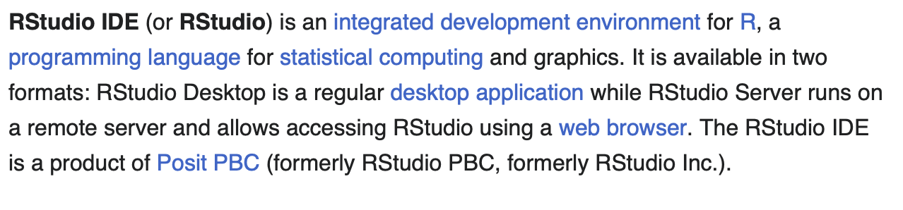
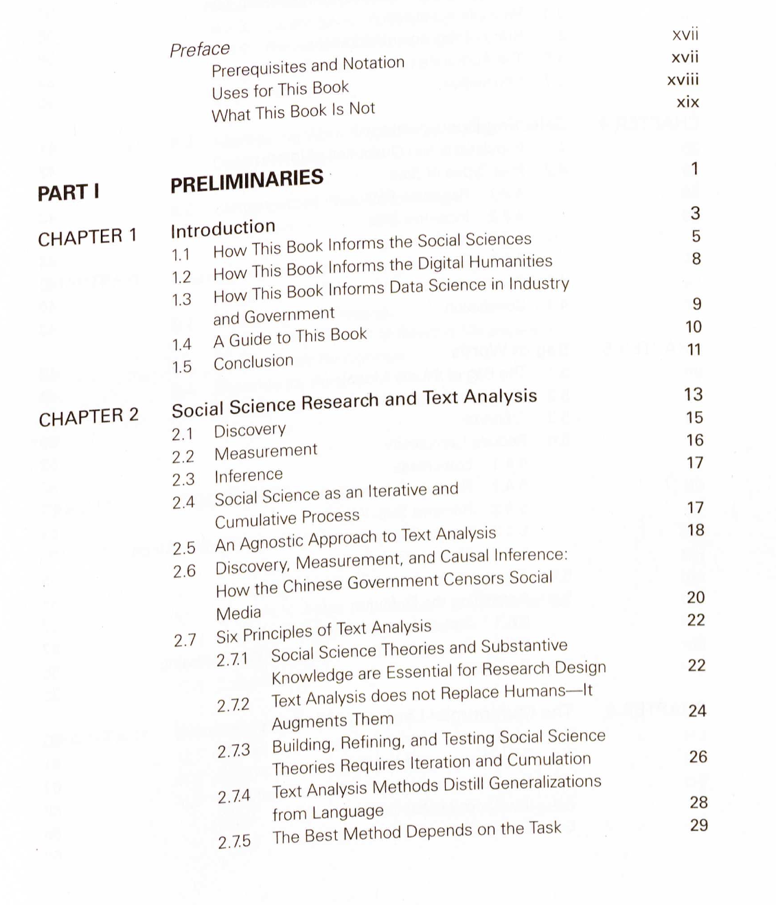

This chapter demonstrates how you can read images and PDF documents into R in an automated fashion. Note that OCR is not always perfect and you might have to do some significant pre- and/or post-processing. I have included some classic pre-processing commands from the `magick` package, post-processing will usually be conducted using RegExes.

## Install `tesseract` and download language packages

```{r echo=FALSE, message=FALSE, warning=FALSE}
vembedr::embed_youtube("2Gx6Mi16g8E")
```

Before we can start OCRing images, we need to install `tesseract` via the command line. The reason for this is that the R package merely binds to the engine, but the OCRing happens "under the hood." You can find instructions on how to install `tesseract` for your respective operating system [here](https://tesseract-ocr.github.io/tessdoc/Installation.html). 

Once successfully installed, we can just load the package. In order to get the best results, we need to define the language our text is in. Multiple options are available (for a list of languages, [see this website](https://ports.macports.org/search/?q=tesseract-&name=on)) and can be downloaded using `tesseract::tesseract_download()` (for Mac and Windows users).

```{r}
needs(tesseract)
english <- tesseract("eng") # use English model

tesseract_download("deu") # download German language model
tesseract_info()[["available"]] # check available languages
```

## OCR 101

Once the package and the language module is installed, you can start OCRing. For illustration purposes, we OCR the first paragraph of the RStudio Wikipedia article: 



```{r}
ocr("figures/rstudio_wiki.png", engine = english)
```
Note that there are still line breaks in there. We can easily replace them with whitespace them using `stringr::str_replace_all()`. Make sure to remove redundant whitespaces using `stringr::str_squish()`

```{r}
needs(tidyverse)
ocr("figures/rstudio_wiki.png", engine = english) |> 
  str_replace_all("\\n", " ") |> 
  str_squish()
```

If we want deeper insights to the confidence `tesseract` has in its word guesses, use `tesseract::ocr_data()`.

```{r}
ocr_data("figures/rstudio_wiki.png", engine = english)
```

## Advanced OCR with `magick` preprocessing

This worked quite well. One reason for this is that screenshots from the internet are usually very "clean." However, often this is not the case, especially with book scans. There might be some noise/speckles in the image, some skewed text, etc. In our next example, we OCR the first page of the "Text As Data" book and preprocess it with `magick` (find instructions for `magick` [here](https://docs.ropensci.org/magick/articles/intro.html))



```{r}
ocr("figures/tad_toc.png") |> 
  cat()
```

As we can see, there are a couple of problems -- some page numbers are not detected correctly, some typos, etc. Perhaps, some manual image pre-processing can help here.

```{r}
needs(magick)

image_read("figures/tad_toc.png") |> 
  image_resize("90%") |> # play around with this parameter
  image_rotate(degrees = 3) |> #straighten picture
  image_contrast(sharpen = 100) |>  # increases contrast
  image_convert(type = "Grayscale") |> # black and white
  image_trim() |> #trim image to remove margins 
  ocr() |> 
  cat()
```

Slight improvements! Still not perfect, but OCR hardly ever is.

## Read PDFs

If we want to read PDFs, we can also harness the power of `tesseract` in combination with `magick` and `pdftools`. In this example, I ocr a multi-page PDF document containing newspaper articles.

```{r}
needs(pdftools)
german <- tesseract(language = "deu")

texts <- map(1:pdf_info("figures/snippet_dereko.pdf")$pages, 
              \(x) {
                pdf_render_page("figures/snippet_dereko.pdf", page = x, dpi = 300) |> 
                  image_read() |> # Convert raw image to magick image object
                  ocr(engine = german) # OCR
                }) |> 
  reduce(c)

texts |> str_sub(1, 100) |> cat()
```

Easy!

## Further links

-   [`tesseract` R package manual](https://cran.r-project.org/web/packages/tesseract/vignettes/intro.html#Extract_Text_from_Images)
-   [`magick` R package manual](https://docs.ropensci.org/magick/articles/intro.html#ocr-text-extraction)

## Exercises

In general, you could try all the `rvest` exercises with `selenium` to see how these things differ. Also every page is different, therefore it will probably be best if you just start with your own things. However, here is a quite tricky example.

1. Take a screenshot of a page of your liking and OCR it. Post-process.

<details>
  <summary>Solution. Click to expand!</summary>
```{r eval=FALSE}
ocr("figures/rstudio_wiki.png", engine = english) |> 
  str_replace_all("\\n", " ") |> 
  str_squish()
```
</details>


2. OCR a PDF document you have available (e.g., one of the course readings). If you get the error "Image too small to scale," you can use `magick::image_resize()`.

<details>
  <summary>Solution. Click to expand!</summary>
```{r eval=FALSE}
texts <- map(1:3, 
              \(x) {
                pdf_render_page("figures/Stoltz:Taylor 2020.pdf", page = x, dpi = 300) |> 
                  image_read() |> # Convert raw image to magick image object
                  image_resize("300%") |> 
                  ocr(engine = english) # OCR
                }) |> 
  reduce(c)
```
</details>

