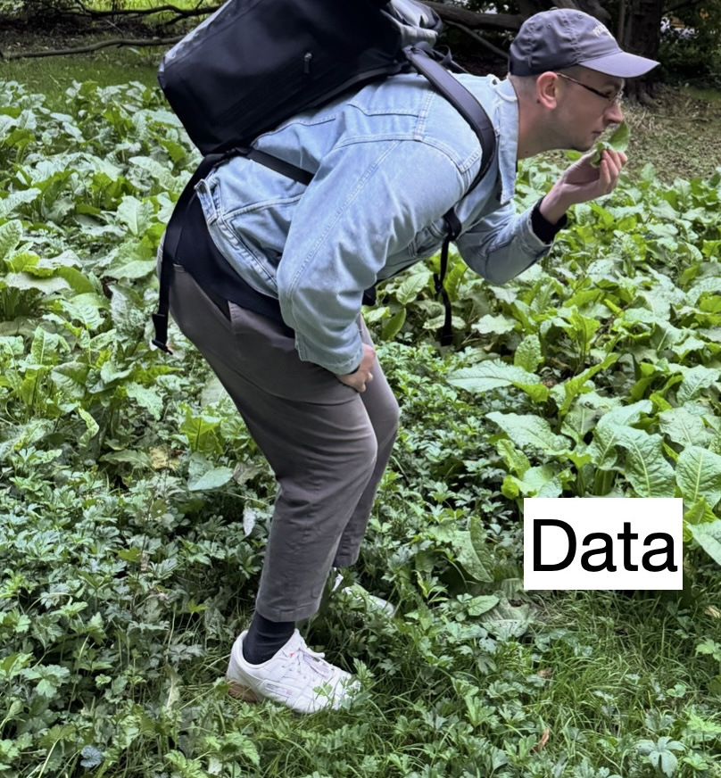

This is a Quarto website for the "Forschungsseminar CSS" course at Leipzig University. It covers different techniques for the aspiring computational social scientist, hence I have dubbed it "Toolbox CSS." You can reach me anytime at [felix.lennert@uni-leipzig.de](mailto:felix.lennert@uni-leipzig.de). If you're interested in my academic work, you can visit [my website](https://felix-lennert.netlify.app). 

{width=300}

Here's the official description:

> The Forschungsseminar in Computational Social Science (CSS) equips you with the tools to analyze human behavior, predict social trends, and tackle complex societal issues using state-of-the-art data science techniques. From web scraping to AI-powered text analysis, you'll learn to harness the power of computation to gain new insights into social phenomena.  
The curriculum covers a range of topics including data management, web scraping, text analysis, analyzing spatial data, and agent-based simulation. Students will hone their R and develop skills in Python, applying these languages to real-world social science problems. The course progresses from fundamental concepts to advanced techniques, including the use of state-of-the-art AI models for text analysis.  
The course structure consists of one lecture and one workshop per week, providing a balance of theoretical knowledge and practical application. Throughout the semester, students will benefit from hands-on coding exercises, one-on-one mentoring, and collaborative projects. The course culminates in a group research paper, allowing students to apply their new skills to a topic of their choice. This course is ideal for social scientists looking to enhance their computational skills. It is geared towards 2nd year Master’s students who are enrolled in the reformed Sociology Master’s program. Interested Bachelor’s students (semester 5 or higher) are also very welcome to attend, they shall send an email to the instructor (felix.lennert@uni-leipzig.de). However, Bachelor’s students will not be able to earn credits with their attendance. 

## Course Structure

The course consists of [lectures](lectures-overview.qmd) introducing each week's content and an [R script](1_r_index.qmd) that provides hands-on coding examples for the content, including videos of yours truly going through the content. 

At the beginning of the course, students are encouraged to form groups based on research interests and general vibes. I require each student group to check in with me at the beginning of each week to report their progress (even if there's nothing to report -- no progress, no problem). This does not count towards any grade but rather serves the purpose of me receiving feedback on the learning experience (this is a new course!) -- and will hopefully help me with providing more appropriate guidance.

Here's an overview of the topics covered:

| WEEK | TITLE | CONTENT | INFORMAL TITLE |
|------|-------|---------|----------------|
| 1 | what is CSS? | Housekeeping; Getting to know each other and your research interests | Whatever you want to know about CSS |
| 2 | new possibilities | REGEX | REGEXES - tame your data |
| 3 | data acquisition I | rvest (R); selenium (Python); APIs | stealing data from websites without them noticing it |
| 4 | data acquisition II | OCR; OpenAI Whisper | making the computer your transcription servant |
| 5 | text as data I | bag of words: dictionary, tfidf, ner/pos | basic text analysis |
| 6 | text as data II | supervised + unsupervised ML | advanced text analysis |
| 7 | text as data III | vector space; embeddings | cutting-edge text analysis |
| 8 | text as data VI | BERT/GPT/NLI | holy shit...text analysis |
| 9 | advanced techniques: geo data I | geo visualization | mapping human behavior in space |
| 10 | advanced techniques: geo data II | weights, autocorrelation, regression | checking out what drives human behavior in space |
| 11 | advanced techniques: simulation I | ABMs - setup | simulating human behavior |
| 12 | advanced techniques: simulation II | ABMs - empirically calibrated | simulating human behavior - but with more empirical realism |
| 13 | paper presentations | paper presentations | show me your work |

## Syllabus

Please click [here to download the latest version of the syllabus](./syllabus/syllabus_toolboxCSS_winter2425.pdf).

```{css echo=FALSE}
.embed-container {
    position: relative;
    padding-bottom: 129%;
    height: 0;
    overflow: hidden;
    max-width: 100%;
}

.embed-container iframe,
.embed-container object,
.embed-container embed {
    position: absolute;
    top: 0;
    left: 0;
    width: 100%;
    height: 100%;
}
```

Alternatively, read it here (probably not the best if you're visiting this page on a mobile device):

<div class="embed-container">
  <iframe src="./syllabus/syllabus_toolboxCSS_winter2425.pdf" style="border: 0.5px"></iframe>
</div>
