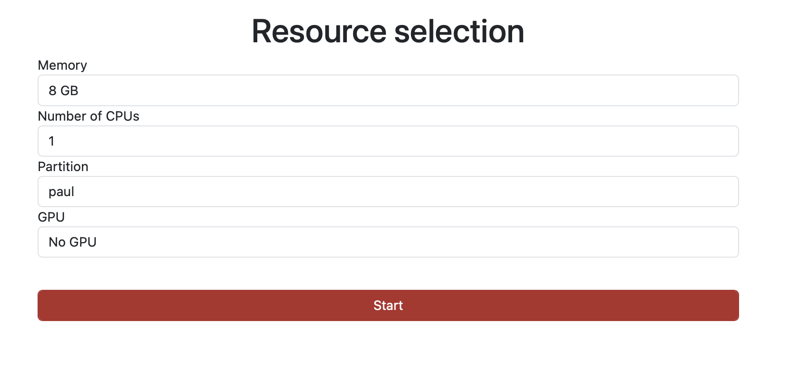
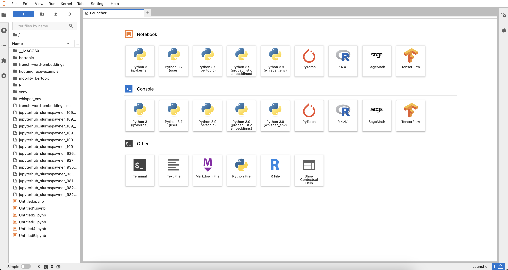
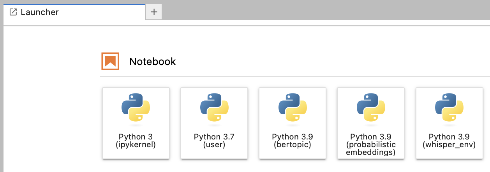

## Intro

This document serves as an introduction to working with the Leipzig University Computer cluster. The cluster is available for members of Leipzig University. You have to register first and ask for access to different resources, and then once it's set up, you can use it for your own research purposes. It comes with a large amount of storage for your data. You can work on these using RStudio via a web app (https://rstudio.sc.uni-leipzig.de/) and it also provides access to Python via JupyterLab (https://lab.sc.uni-leipzig.de/). Furthermore, you can send jobs using Slurm. 

Since the RStudio web app is very similar to the IDE you can run on your own machine, this tutorial will rather focus on the yet unknown -- i.e., Python, the terminal, and Slurm jobs. I will first describe where and how you can register for access, then delve into daily Python workflows (i.e., basic terminal commands, authentication, choosing modules, creating project-specific environments, and setting up dedicated kernels), and then finally introduce Slurm which allows you to send "jobs" for more resource-intensive computations that you couldn't run in a classic Jupyter Notebook.

## Registration and Access Setup

Before utilizing the cluster, you need to register and request access to the necessary resources. Here's how to get started:

1. **Request SC Infrastructure Access**:
   - Visit the [Scientific Computing Knowledge Base](https://www.sc.uni-leipzig.de/) and navigate to the "Request SC infrastructure" section.
   - Complete the form with your university credentials and specify the resources you require. A good start is to ask for "paula,clara,paul,jupyter,rstudio"
   - After submission, your account will be created, and you'll receive an email with your SC user information.

2. **Accessing the Cluster**:

When accessing the cluster, make sure that you are connected to the university's internal network (i.e., you are physically in a university building and connected to the local wifi network) or use a VPN ([instructions](https://www.urz.uni-leipzig.de/en/servicedesk-und-hilfe/hilfe-zu-unseren-services/netz-und-zugang/hilfe-vpn-zugang-zum-uni-netz-vpn-webvpn)).

If this is the case, you can access the services through your web browser: 

- **JupyterLab**: Navigate to [https://lab.sc.uni-leipzig.de/](https://lab.sc.uni-leipzig.de/) and log in with your SC credentials.
- **RStudio**: Go to [https://rstudio.sc.uni-leipzig.de/](https://rstudio.sc.uni-leipzig.de/) and log in with your SC credentials.

For submitting jobs, you need to connect to the cluster from your terminal. To do this, the most convenient way is to authenticate via SSH. SSH gives you the possibility to connect safely to another computer (the server, in our case). Then, once connected, you can control the remote machine via terminal commands. This is good for submitting jobs. Everything else (i.e., interactive coding, code testing, etc.) should be done using the web interface in JupyterLab or RStudio.

Before you can authenticate using SSH, you need to create a key pair on your own machine and upload the public key to the cluster. You can find an extensive tutorial [online](https://www.sc.uni-leipzig.de/03_System_access/Cluster/). 

Once you have access, you can connect using your terminal with your SC username. 

```
ssh <your_sc_username>@login01.sc.uni-leipzig.de
```

## Daily Python Workflows

Once you have access, you can set up your Python environment and workflows. 

When you access JupyterLab via https://lab.sc.uni-leipzig.de, you first need to choose your server and the resources you need. `paul` has CPUs only, while `clara` and `paula` also have GPUs available.



Once you have launched the server, you reach the "Launcher." While you can do most of these things in the JupyterLab GUI, I recommend using terminal commands since it's fast and -- once you've got the hang of it -- easier. In the Launcher, you can open a Terminal window by clicking "Other > Terminal" (see screenshot below).




### Basic Terminal Commands

Familiarity with basic terminal commands is essential for navigating and managing files on the cluster. Here are some common commands:

- `ls`: List directory contents.
- `cd`: Change the current directory, e.g., `cd my_folder`
- `pwd`: Display the current directory path.
- `mkdir`: Create a new directory (make sure you have navigated to the right folder first).
- `rm`: Remove files or directories, e.g., `rm my_file`

For a comprehensive list, consult the [Linux Command Reference](https://community.linuxmint.com/tutorial/view/244).

### Module Selection

The cluster uses environment modules to manage software. To see available modules, type:

```
module avail
```

Then you have to choose one *first thing*. I usually go for `Python/3.10.8-GCCcore-12.2.0`. You can activate this module using `module load Python/3.10.8-GCCcore-12.2.0`. The module essentially provides the environment needed to run your code..

### Creating a Project-specific Virtual Environment

Then you will want to create a virtual environment for your dedicated project. The virtual environment allows you to install the relevant Python packages that you will need, keeping your Python distribution clean and ensuring that you will not run into compatibility issues between packages.

For creating a virtual environment, you can use the terminal. First, navigate to your project's folder (make sure to create it first), then create the environment using `venv`, and finally activate it.

```
mkdir project_folder  
cd project_folder  
python -m venvmy_project_env  
source my_project_env/bin/activate
```

Once it is activated, you can start installing the packages you require using `pip` (e.g., `pip install pandas`). 

### Setting up Kernels

To make your life easier in the JupyterLab, you should set up a dedicated kernel in your JupyterLab. The kernel runs in the background of your notebook, takes your code, processes it, and finally returns the results. Each notebook is connected to one kernel and the kernel defines the language and environment the notebook runs in. 

You can set up a dedicated kernel as follows: first, activate your environment, second, install `ipykernel`, third, create the Jupyter kernel containing your environment, you can change the name in the final argument after `display-name`.

```
source my_project_env/bin/activate  
pip install ipykernel  
python -m ipykernel install --user --name=my_project_env --display-name "Python  
3.9 (my_project_env)"  
```

Once this is done, in the future, you will have to choose your module first -- matching the Python version of your kernel (e.g., load a Python 3.9 module if your kernel uses Python 3.9). Then you can click one of the buttons (see screenshot) -- depending on the environment you want to work with -- and start coding.



Find more information [here](https://www.sc.uni-leipzig.de/05_Instructions/Jupyter/).

## Slurm

Slurm (Simple Linux Utility for Resource Management) is a powerful job scheduling system used on HPC (High-Performance Computing) clusters to manage and allocate resources among users. Job here means that if you have a script that needs to run for longer, e.g., classifying large amounts of text or comparable things, you can set this up *as a job*. This allows the server to manage its resources better by distributing the different jobs all over the cluster.

Here’s a quick guide on the basic Slurm commands to help you submit, monitor, and manage jobs.

### The Script

A Slurm job script is a shell script with Slurm-specific options defined at the beginning. Here’s an example template (the `<-- [comment]` are just for annotation and are not allowed in the real script):

```
#!/bin/bash eval=FALSE  
#SBATCH --time=02:30:00 # <-- allocated time  
#SBATCH --mem=128G <-- required memory
#SBATCH --ntasks=1 <-- number of tasks  
#SBATCH --job-name=1_unsupervisedTopicModel <-- job name  
#SBATCH --partition=clara <-- the server partition you want to work on  
#SBATCH --gpus=v100:1 <-- the gpu you need, ":1" stands for one gpu required  
##SBATCH --mail-type=END <-- sending you an email once it's done  
#SBATCH --mail-user=[username]@uni-leipzig.de <-- your email  
#SBATCH --output=$HOME/jobfiles/log/%x.out-%j <-- where you want your log file  

# load modules  
module purge  
module load Python/3.11.5-GCCcore-13.2.0  
module load CUDA/12.1.1     

# Activate the virtual environment  
source /home/sc.uni-leipzig.de/[username]/venv/bertopic_env/bin/activate  

# Confirm the Python version and environment being used  
python --version  
which python  

# Run the Python script  
python /home/sc.uni-leipzig.de/[username]/bertopic_scripts/script_1.py  
```

### Basic Slurm Commands

To submit a job, first connect to the server via ssh. Then you can use the following commands:

- **Submitting a Job**: To submit a job, use the `sbatch` command.

```
sbatch job_script.sh
```

  This command sends the job script to Slurm, which then schedules the job to run on available resources.

- **Checking Job Status**: To check the status of your submitted jobs, use:

```
squeue -u [your_username]
```

  Replace `[your_username]` with your actual username. This will display all jobs you have running or queued on the cluster.

- **Cancelling a Job**: To cancel a job, use:

```
scancel [job_id]
```

Replace `[job_id]` with the actual ID of the job that you defined in the script. You can also find the job ID using `squeue`.

- **Monitoring Resource Usage**

You can monitor resource usage and efficiency with commands like:

```
  sacct -j [job_id]
```

This command provides detailed information about your job, including CPU and memory usage. Replace `[job_id]` with your job’s ID.

So, in practice:

First, write your Python script and test it with a small sample of your data in "interactive coding mode" in the JupyterLab. This will also give you an idea of how much time your job will require. Then, refine the script so that it takes the full data and build the Slurm script in your text editor (needs to be an `.sh` file)

Once you’ve created your Slurm job script, you can log in via SSH and submit the script using:

```
sbatch job_script.sh
```

After submitting, you can use `squeue` to check its status or `scancel` if you need to stop it. Monitoring with `sacct` will help you optimize resource requests for future jobs, making your submissions more efficient and improving queue times.

Happy coding.